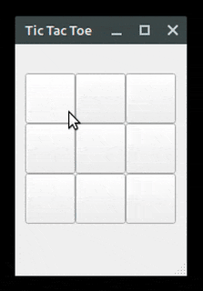

# Tic Tac Toe 🎮

This is a GUI version of the Tic Tac Toe game with a computer opponent. Here's
a demonstration of how the game works.



This game was developed using [Qt](https://qt.io) 5.15.2. To run the game, you have 2 options:

1. Either to build & run from the Qt itself; which is as simple as pressing
`Ctrl + r`.
2. To build & run from the terminal:

```bash
qmake tic-tac-toe.pro
make
./tictactoe
```

Cheers 🍻 & Enjoy 🎉.
